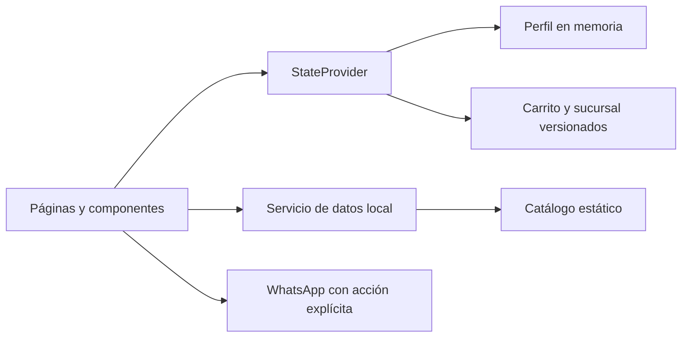

# Frigorífico online — demo frontend

Experiencia de catálogo y preparación de pedidos para una cadena de sucursales ficticia. El proyecto demuestra navegación de e-commerce, estado compartido, selección de sucursal, carrito y armado de mensajes para WhatsApp sin presentar una demo como un sistema transaccional real.

> **Alcance:** no hay backend, autenticación, inventario real ni creación de pedidos. Productos, precios, disponibilidad y sucursales son datos de demostración. El último paso solo abre WhatsApp con un mensaje preparado por el usuario.

## Qué problema modela

Un comercio con varias sucursales necesita que la persona elija dónde comprar antes de consultar stock, arme un carrito coherente con esa sucursal y pueda enviar una consulta estructurada por un canal conocido.

La demo cubre:

- selección y cambio de sucursal;
- catálogo, filtros y detalle de producto;
- disponibilidad simulada por sucursal;
- carrito con cantidades por unidad o peso;
- perfil temporal y flujo mayorista demostrativo;
- preparación explícita de una consulta por WhatsApp.

## Stack

- React 19 y TypeScript
- React Router 7 con rutas hash
- Vite 8
- Tailwind CSS 3 compilado localmente
- Lucide React

## Arquitectura



`StateProvider` concentra sucursal, carrito y perfil. El catálogo vive en el repositorio y el servicio asíncrono local conserva una frontera clara para una futura API. Los datos personales del perfil no se persisten; carrito y sucursal usan claves versionadas, validación de esquema y recuperación segura ante storage corrupto o no disponible.

## Ejecutar localmente

Requiere Node.js `^20.19` o `^22.12`.

```bash
npm ci
npm run dev
```

Comandos de verificación:

```bash
npm run typecheck
npm run build
npm audit
```

No se requieren variables de entorno.

## Decisiones de seguridad y privacidad

- se eliminó la inyección de claves Gemini que no tenía consumidor;
- Tailwind se compila localmente, sin ejecutar el CDN de desarrollo en producción;
- el perfil con PII solo existe en memoria;
- el contenido recuperado de `localStorage` se valida antes de usarlo;
- los enlaces abiertos en una pestaña nueva usan aislamiento `noopener,noreferrer`;
- la interfaz distingue entre “abrir WhatsApp” y “pedido recibido”.

## Limitaciones conocidas

- no hay stock, precios ni sucursales reales;
- no existe checkout, pago, cuenta de usuario ni persistencia de servidor;
- WhatsApp puede ser bloqueado por el navegador si se deshabilitan ventanas emergentes;
- las imágenes del catálogo son recursos remotos y requieren conexión;
- no hay suite automatizada; la calidad se controla con TypeScript, build y auditoría de dependencias.

## Estructura

```text
components/   layout y componentes compartidos
pages/        pantallas y flujos
services/     estado global y frontera de datos
types.ts      contratos de dominio
index.css     estilos Tailwind locales
```

## Estado de demo

No hay un deployment público verificado. Para revisar el proyecto, ejecutalo localmente con los comandos anteriores.

## Autor

Desarrollado por [Nicolás De Felippe](https://github.com/nicodf91) como proyecto de portfolio.
